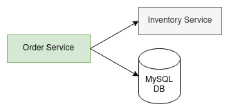

# [Ballerina] Inventory management system

The sample is based on a simple API written for a inventory-management system. Following is the high level component diagram.



Following is the service description.
```ballerina
type OrderService service object {
    *http:Service;

    resource function get orders() returns Order[]|error;
    resource function get orders/[int id]() returns Order|OrderNotFound|error;
    resource function post orders(NewOrder newOrder) returns OrderCreated;
};
```

## Prerequisites

- Ballerina SL update 8+
- Docker

## Setup environment

### With Docker Compose

1. Checkout the code base and move to the root folder.
2. Execute `build-docker-images.sh` script to generate the necessary docker images.
3. Execute `docker compose up`.

### Without Docker Compose

1. Setup a MySQL database.
2. Execute the script `init.sql` in db-setup.
3. Build and run the `inventory_svc` project.
```sh
bal build inventory_svc;
bal run inventory_svc/target/bin/inventory_svc.jar
```

4. Build and run the `order_svc` project.
```sh
bal build order_svc;
bal run order_svc/target/bin/order_svc.jar
```

## Try out

- To start the completed setup run `docker compose up`.
- To send request open `inventory-mng-request.http` file using VS Code with `REST Client` extension.

